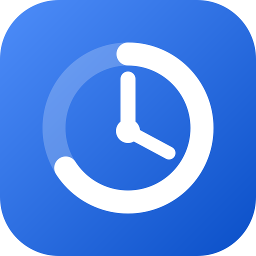
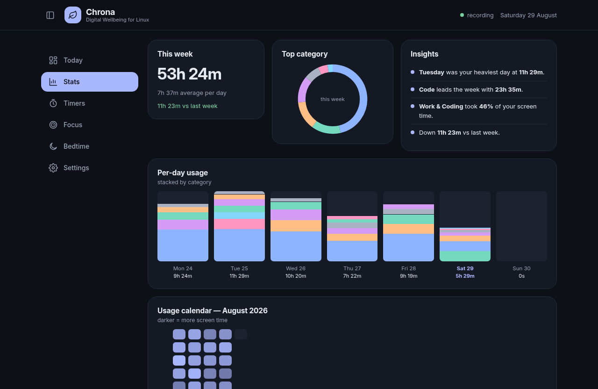
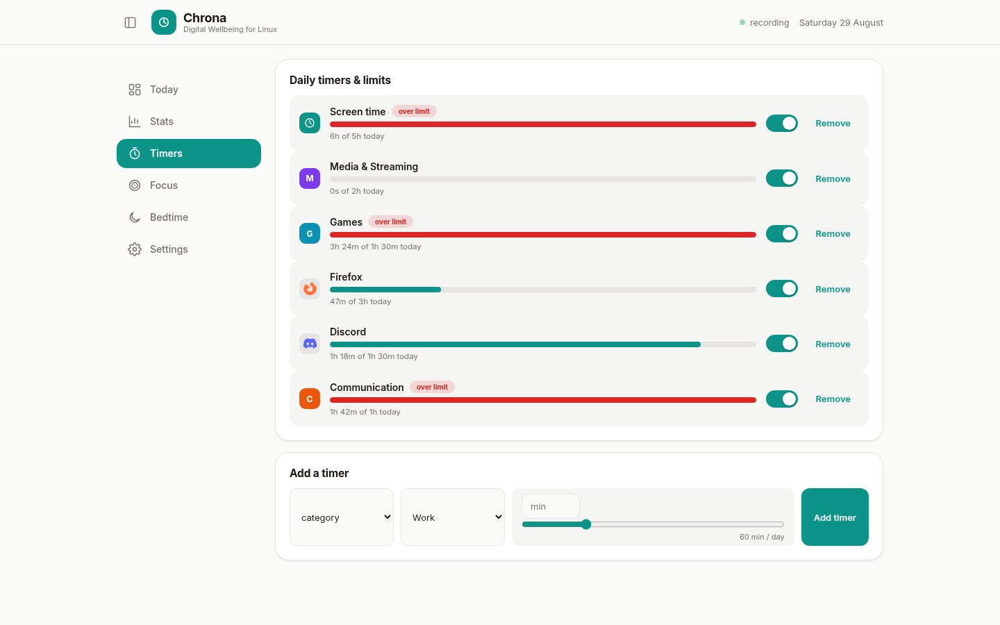
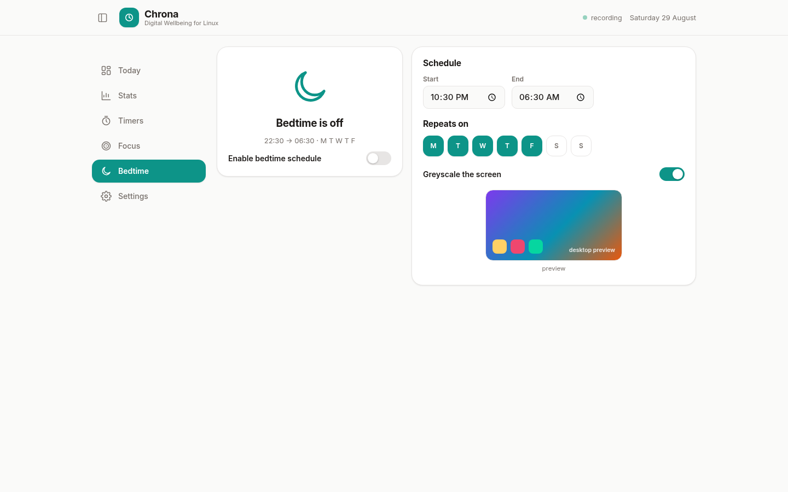
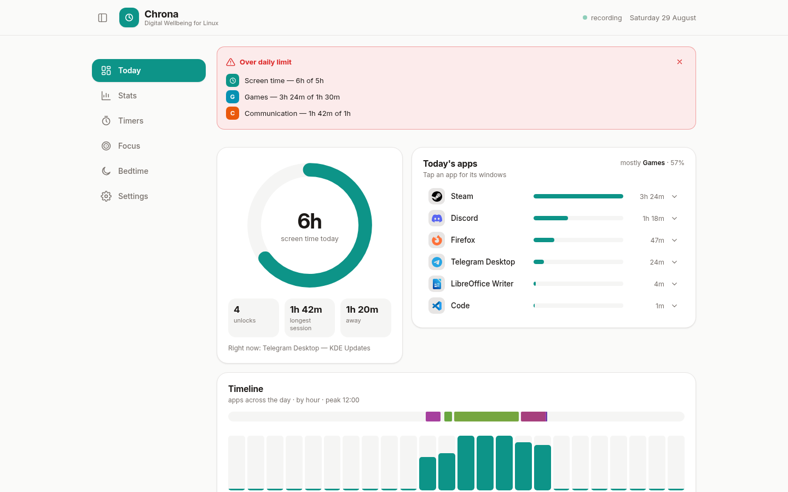
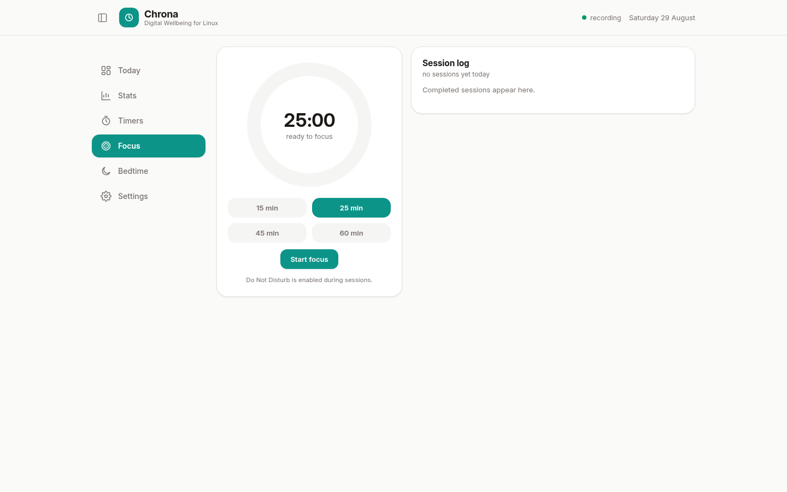
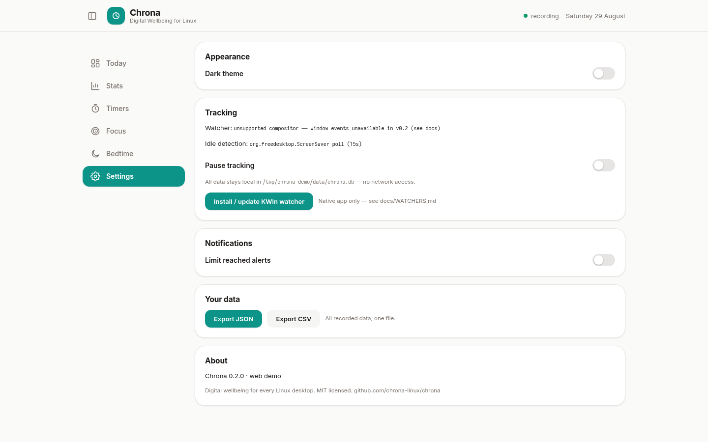
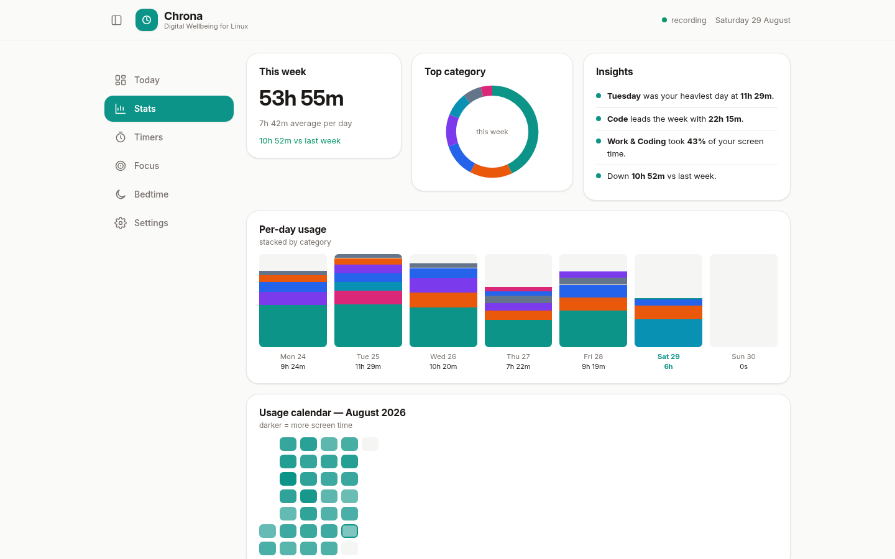

<div align="center">



# Chrona

**Digital wellbeing for every Linux desktop.**

Screen time, per-app usage, category breakdowns and daily goals —
a Material You dashboard on top of a tiny Rust daemon.
**Zero network access. Ever.**

[](https://github.com/CodeAbhi826/chrona/actions/workflows/ci.yml)
[](https://github.com/CodeAbhi826/chrona/releases)
[](LICENSE)
[](#compositor-support)
[](#does-chrona-ever-touch-the-network)
[](#architecture)

[Features](#features) · [Screenshots](#screenshots) · [Install](#install) · [Compositor support](#compositor-support) · [Comparison](#how-chrona-compares) · [Scripting](#scripting-the-daemon) · [Roadmap](#roadmap) · [FAQ](#faq)


</div>

---

Chrona is a from-scratch, [Digital Wellbeing](https://www.android.com/digital-wellbeing/)-style
time tracker for the Linux desktop. A ~10 MB Rust daemon records which window
is focused and subtracts the time you were away; a native Slint GUI (or the
browser demo) turns that into rings, timelines and heatmaps; and a rules
engine maps everything to categories you can re-edit at any time. Storage is
one SQLite file on your disk — there is no account, no sync and no telemetry,
because there is no network code at all.

## Features

- **Today / Week / Month dashboards** — screen-time ring with goal progress, day timeline strip, hourly activity bars, category donut, per-day stacked bars, month heatmap and week-over-week comparison.
- **Per-app and per-window detail** — every app gets usage time, session counts and its most-used window titles (documents, sites, projects), expandable right in the list.
- **Real app names and icons** — window IDs are resolved against freedesktop `.desktop` entries (`StartupWMClass`, exec name, PWA app-id), so rows show *LibreOffice Writer* with its real icon, not a machine ID.
- **PWAs as first-class apps** — installed web apps (Chrome/Brave "Install app…") get their own name, icon and stats instead of counting as browser time.
- **Smart categorisation** — built-in rules map apps to Work / Browsers / Communication / Media / Creative / Games / System, and title rules catch streaming inside browsers (Netflix in Firefox counts as *Media*, not *Browsers*). Your rules always win — and editing one re-categorises your entire history, because rules run at query time.
- **Goals that escalate** — an overall screen-time goal plus per-app or per-category daily limits. You get a heads-up at 90 % of a limit, a critical notification the moment it is crossed, and optional reminders every 15 minutes while you stay over it.
- **AFK-aware by design** — idle and lock-screen time is detected and subtracted (and shown as *away* time), so screen time means *actually at the machine*, with an Android-style unlocks counter.
- **Pause tracking** — one switch (Settings, or the API) suspends recording; paused time counts as away, never as usage.
- **Native and lightweight** — Rust daemon (systemd user service, ~10 MB RAM) plus a GPU-accelerated Slint GUI. No Electron, no Chromium, no browser engine — the whole stack idles around ~50 MB.
- **Private by architecture** — one local SQLite file, a Unix-socket API with `0600` permissions, and no telemetry, sync or network code to opt out of. Export everything to JSON or CSV anytime.

## Screenshots

Captured from the live demo harness ([`tools/demo`](tools/demo/README.md)) —
the real daemon and rules engine, a simulated window-event feed, real icons
resolved from `.desktop` files:

| Today — dark theme, dashboards, goals, real icons | Today — expandable per-window titles |
|---|---|
|  |  |

| Stats — week bars, heatmap, insights | Timers — daily limits per app / category |
|---|---|
|  |  |

| Bedtime — schedule + greyscale preview | Today — light theme |
|---|---|
|  |  |

<details>
<summary><b>More screenshots</b> — Focus timer, Settings, Stats in light theme</summary>

| Focus — session timer | Settings |
|---|---|
|  |  |



</details>

## Install

### One command (Arch, Debian, Ubuntu, Fedora, RHEL/Rocky/Alma, openSUSE, Void — and anything glibc/x86_64)

```bash
curl -fsSL https://raw.githubusercontent.com/CodeAbhi826/chrona/main/install.sh | bash
```

The installer auto-detects everything: distro and package manager (pacman /
apt / dnf / zypper / xbps), privileges (sudo, or a no-root `--user` mode),
downloader (curl/wget/gh), desktop environment and session type. It installs
the binaries from the latest GitHub release, the systemd user unit (XDG
autostart fallback where there is no systemd), the app-menu entry with icons,
and on KDE Plasma the KWin watcher script — then verifies the daemon and runs
an end-to-end window-event test. From a checkout, `bash install.sh` does the
same using the local packaging files.

| | Supported |
|---|---|
| **Distros** | Arch / Manjaro / EndeavourOS · Debian / Ubuntu / Mint / Pop!_OS · Fedora / RHEL / Rocky / Alma · openSUSE · Void · any other glibc x86_64 Linux |
| **Shells** | bash, zsh, fish, anything — system installs need zero shell config (`--user` mode edits the login shell's rc file) |
| **Privileges** | root/sudo/doas, or fully rootless with `--user` |

<details><summary>Pinned / offline / no-root variants</summary>

```bash
bash install.sh v0.2.2     # pin a version
bash install.sh --user     # install into ~/.local (no root at all)
```

Alpine (musl) and non-x86_64 are build-from-source for now — see below.
</details>

### From source (any distro)

Requires [Rust](https://rustup.rs/) (stable) and a Linux desktop. The build is
dependency-light — SQLite is bundled, Wayland/X11 libraries are loaded at
runtime.

```bash
git clone https://github.com/CodeAbhi826/chrona
cd chrona
cargo build --release -p chronad -p chrona
install -Dm755 target/release/{chronad,chrona} -t ~/.local/bin/
install -Dm644 packaging/chrona.service ~/.config/systemd/user/
```

To also get a proper launcher entry (app menu / overview search showing
*Chrona* with its clock icon instead of a bare binary), install the shipped
`.desktop` file and the hicolor icons it references — the same files the
packages install, just into your user directories:

```bash
install -Dm644 packaging/chrona.desktop ~/.local/share/applications/
install -Dm644 assets/icon.svg ~/.local/share/icons/hicolor/scalable/apps/chrona.svg
install -Dm644 assets/icon-256.png ~/.local/share/icons/hicolor/256x256/apps/chrona.png
```

Log out and back in (or run `update-desktop-database ~/.local/share/applications`)
if your launcher does not pick the entry up immediately.

### Arch Linux

An AUR package is planned; until then, build with the packaged
[`PKGBUILD`](packaging/PKGBUILD) (installs binaries, systemd unit, `.desktop`
entry and hicolor icons):

```bash
cd chrona/packaging
makepkg -si
```

### First run

```bash
systemctl --user enable --now chrona   # start the daemon at every login
chrona                                 # open the dashboard
```

On **KDE Plasma Wayland**, click **Install KWin watcher** in Chrona → Settings
(or run `./kwin/install.sh`), then focus a few windows.

On **Sway / Hyprland / river / niri / any X11 session**, tracking starts
immediately — nothing to install.

> **First 30 minutes**: the dashboard fills as you use your machine. The week
> ring compares against your previous week, so it reads "first tracked week"
> until day 8.

### Try it without a desktop (demo harness)

Not at your Linux box right now? The repo ships a demo harness that runs the
**real daemon** with a simulated watcher feed and serves the dashboard in a
browser — every number is computed by the real Rust code, only the window
events are fake:

```bash
./tools/demo/run_demo.sh        # → http://localhost:3000
```

Details in [tools/demo/README.md](tools/demo/README.md).

## Compositor support

| Session | Window tracking | Idle tracking | Notes |
|---|---|---|---|
| **KDE Plasma 6 (Wayland)** | ✅ KWin script → D-Bus | ✅ ScreenSaver D-Bus | One-click install from Settings |
| **GNOME 45+ (Wayland)** | ✅ Shell extension → D-Bus | ✅ Mutter IdleMonitor | One-time log out/in after install |
| **Sway / Hyprland / river / niri** (Wayland) | ✅ `wlr-foreign-toplevel` | ✅ `ext-idle-notify` | Works out of the box |
| **Any X11 session** (incl. KDE/GNOME on X11) | ✅ EWMH polling | ✅ MIT-SCREEN-SAVER | Works out of the box |
| PWAs | ✅ | ✅ | PWAs are separate windows with their own titles, so they are tracked like any app |

KDE Wayland deserves a note: KWin intentionally does not implement the
`wlr-foreign-toplevel` protocol other compositors use. Chrona ships a tiny
KWin script (~30 lines) that reports window activations over the session
bus — the same trick nothing else on the market combines with a full GUI.
GNOME Wayland gets the same treatment via a ~100-line GNOME Shell
extension reporting to the identical D-Bus interface.

## Architecture

```
┌────────────────────────────── your session ──────────────────────────────┐
│                                                                          │
│  KWin script ──D-Bus──┐  GNOME ext ──D-Bus──┐  wlr-foreign-toplevel ──┐ │
│  (Plasma Wayland)     │  (GNOME Wayland)    │  (Sway/Hyprland/…)     │ │
│  X11 EWMH poll ───────┴──────────────────────┴──────────┐             │ │
│  (X11 sessions)         ▼                               ▼             │
│                 ┌──────────────────────────────────────────────────┐    │
│                 │ chronad — Rust daemon (systemd --user, ~10 MB)   │    │
│                 │  • event fold → SQLite (one file, WAL)           │    │
│                 │  • AFK subtraction (ScreenSaver / ext-idle / X)  │    │
│                 │  • rules engine (regex, user rules win)          │    │
│                 │  • local API: $XDG_RUNTIME_DIR/chrona.sock       │    │
│                 └──────────────────────────────────────────────────┘    │
│                       ▲                                               │    │
│                       │ JSON over Unix socket (0600)                  │    │
│                 ┌─────┴────────────┐                                  │    │
│                 │ chrona — Slint UI│   Light + dark theme toggle,    │    │
│                 │ GPU-accelerated  │   Google Sans/Inter typography  │    │
│                 │ native desktop   │                                  │    │
│                 └──────────────────┘                                  │    │
└──────────────────────────────────────────────────────────────────────────┘
                        ✂ no network. no cloud. no accounts.
```

More detail in [docs/ARCHITECTURE.md](docs/ARCHITECTURE.md) and
[docs/WATCHERS.md](docs/WATCHERS.md) (per-compositor setup + troubleshooting).

## Scripting the daemon

The Unix socket speaks one-line JSON:

```bash
echo '{"id":1,"cmd":"status"}' | socat - UNIX-CONNECT:$XDG_RUNTIME_DIR/chrona.sock
echo '{"id":2,"cmd":"day"}'    | socat - UNIX-CONNECT:$XDG_RUNTIME_DIR/chrona.sock
```

Commands: `status day week month range app rules rule.add rule.del goals
goal.set goal.del settings.get settings.set export purge`. Full list in
[docs/ARCHITECTURE.md](docs/ARCHITECTURE.md#the-api).

Want your terminal in the Work category? Add a rule:

```bash
echo '{"id":3,"cmd":"rule.add","args":{"pattern":"kitty|konsole","field":"app","category":"work"}}' \
  | socat - UNIX-CONNECT:$XDG_RUNTIME_DIR/chrona.sock
```

Editing rules re-categorises your **entire history** — categorisation happens
at query time, never at write time.

## How Chrona compares

The short version (the [full matrix](docs/COMPETITORS.md) covers six tools
and forty capabilities):

| | Chrona | ActivityWatch | RescueTime | Google Digital Wellbeing |
|---|---|---|---|---|
| 100 % local, no account | ✅ | ✅ | ❌ cloud | ❌ device-linked |
| Native (non-Electron) UI | ✅ Slint | 🟡 web dashboard | ❌ | n/a (phone) |
| Overall screen-time goal | ✅ | ❌ | ❌ | ✅ |
| Per-app / per-category limits | ✅ | ❌ | ✅ | ✅ |
| Escalating limit alerts | ✅ 90 % → critical → nags | ❌ | 🟡 | 🟡 |
| Real app names + icons | ✅ `.desktop` + icon theme | 🟡 | ✅ | ✅ |
| PWA tracked as its own app | ✅ | 🟡 browser time | 🟡 | 🟡 |
| KDE Plasma Wayland, out of the box | ✅ KWin script | 🟡 awatcher | ❌ | n/a |
| Blocking / enforcement | ❌ roadmap | ❌ | ✅ premium | ✅ |
| Per-URL browser tracking | ❌ roadmap | ✅ extension | ✅ extension | n/a |

Honest summary: ActivityWatch tracks but has no goals layer; RescueTime and
Cold Turkey enforce but are cloud-bound or closed-source; Digital Wellbeing
is the UX gold standard but lives on your phone. Chrona is the local-first,
goal-driven, native take for the Linux desktop.

## Roadmap

- [x] GNOME Wayland shell extension (window events) — shipped
- [ ] Enforcement: soft-block "take a break" screen when a limit is hit
- [ ] Focus sessions wired to Do Not Disturb (KDE + GNOME D-Bus)
- [ ] Per-day-of-week limit schedules (weekend vs weekday budgets)
- [ ] Weekly report notification (Sunday-evening digest)
- [ ] Wind-down schedule (grayscale/dim reminders)
- [ ] Browser companion for per-URL granularity

Feature gaps vs the competition are tracked in
[docs/COMPETITORS.md](docs/COMPETITORS.md).

## FAQ

### Where does my data live?

In one SQLite database — `~/.local/share/chrona/chrona.db` (WAL mode). Back
it up, copy it between machines, inspect it with `sqlite3`, or delete it to
start over. `export` dumps everything to JSON/CSV.

### Does Chrona ever touch the network?

No. There is no telemetry, no update pinger, no account, no sync — the
binary contains no network client code at all. The daemon's only interface
is a Unix-domain socket with `0600` permissions, readable only by your user.
The architecture makes "it secretly phones home" impossible, not just
promised.

### What does it cost?

~10 MB RAM for the daemon, ~50 MB for the GUI (GPU-accelerated Slint), a few
seconds of CPU per day. The event pipeline folds window activations into
second-resolution rows; a year of history stays in single-digit megabytes.

### Why does GNOME Wayland need an extension?

GNOME Shell, like KDE's KWin, doesn't implement `wlr-foreign-toplevel` — and
unlike KDE, it has no user-installable script hook. So Chrona ships a small
GNOME Shell extension (~100 lines, `gnome/chrona@chrona.local/`) that reports
window focus to the daemon over the session bus — install it via
`bash install.sh`, the Settings page, or see [docs/WATCHERS.md](docs/WATCHERS.md).
Idle tracking (Mutter IdleMonitor) works without it.

### I'm on KDE Wayland and nothing is being tracked

Install the KWin watcher: Chrona → Settings → **Install KWin watcher**, then
switch windows a few times. See [docs/WATCHERS.md](docs/WATCHERS.md) for
verification steps and troubleshooting.

### I'm on GNOME Wayland and nothing is being tracked

Install the extension (Chrona → Settings → **Install GNOME extension** or
`bash install.sh`), then **log out and back in once** — GNOME only loads
extensions at shell startup. Verify with `gnome-extensions list --enabled |
grep chrona`, then switch windows and check the dashboard.

## Contributing

PRs welcome — `cargo fmt`, `cargo clippy --workspace --all-targets -- -D warnings`
and `cargo test --workspace` must pass (CI enforces it). The watcher layer is
deliberately pluggable: a new compositor is one new module in
`crates/daemon/src/watchers/`.

## License

[MIT](LICENSE) — Chrona contributors. Bundled Inter is
[SIL OFL 1.1](assets/fonts/Inter-OFL.txt).

Inspired by the UX of Google's Digital Wellbeing, and by years of
ActivityWatch normalising local-only time tracking. Both are great; Chrona
aims to be the native, goal-driven Linux take.
