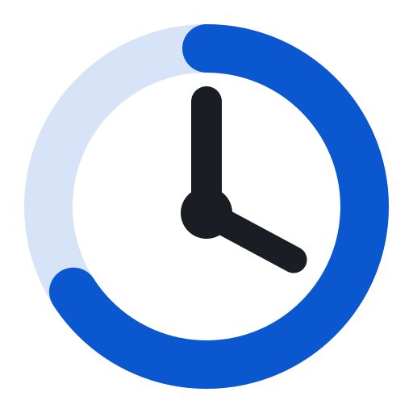
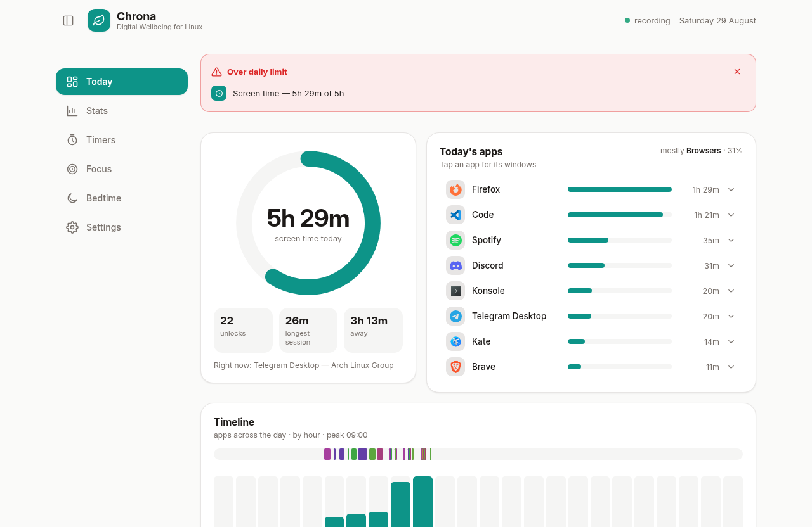
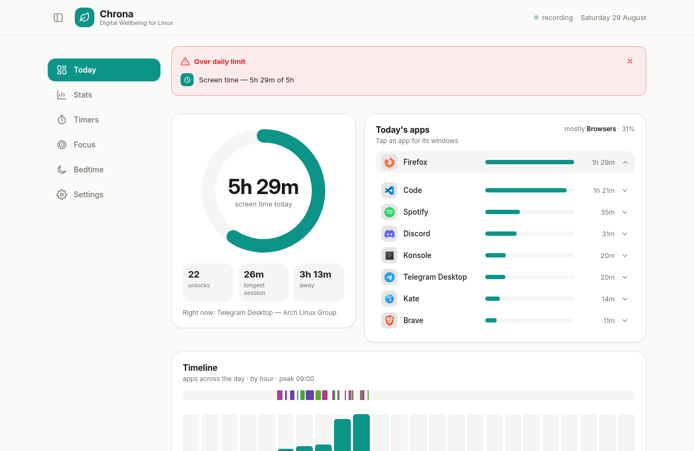
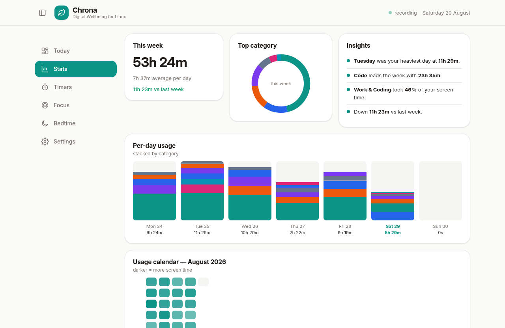
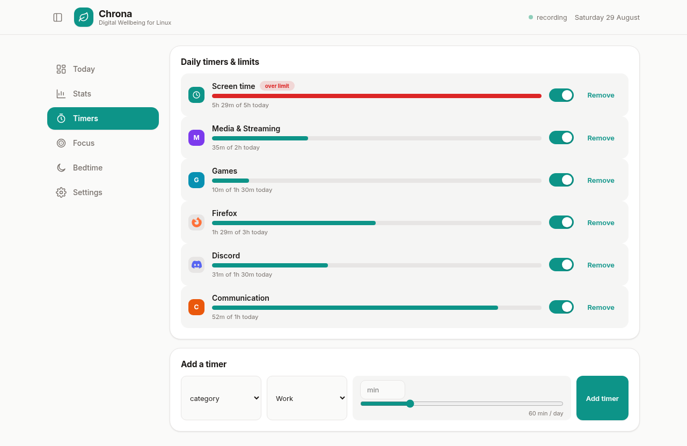
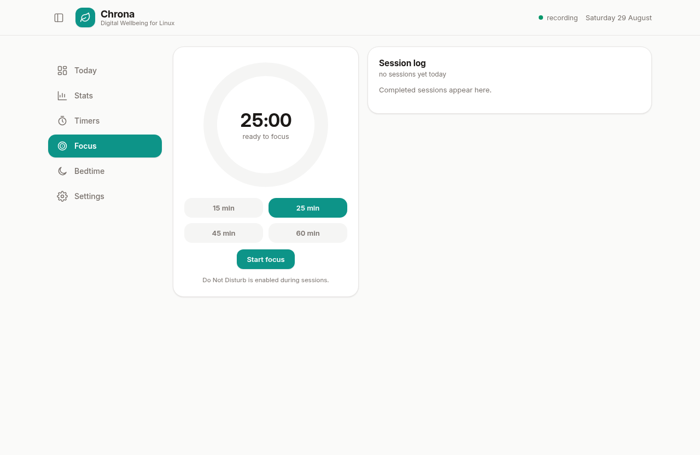
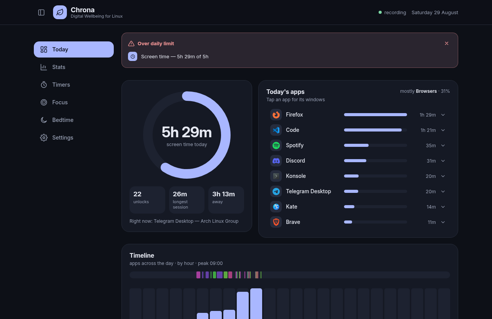

# Chrona

**Digital wellbeing for every Linux desktop.** Screen time, per-app usage, category breakdowns and daily goals — with a Material You dashboard, a tiny always-on daemon, and **zero network access. Ever.**

<p>
  
  
  
</p>

<p align="center">
  
</p>

Chrona is a from-scratch, Google-Digital-Wellbeing-style time tracker for the Linux desktop:

- **Today / Week / Month dashboards** — total screen time, day timeline strip, hourly timeline, category donut, per-day stacked bars, month heatmap, week-over-week comparison.
- **Per-app and per-window detail** — every app gets usage time, session counts and its most-used window titles (documents, sites, projects). PWAs (installed web apps) are tracked as first-class apps with their own name and icon.
- **Smart categorisation** — built-in rules map apps to Work / Browsers / Communication / Media / Creative / Games / System, and title rules catch streaming inside browsers (Netflix in Firefox counts as *Media*, not *Browsers*). Your own rules always win.
- **Real app names and icons** — the daemon resolves window ids against freedesktop `.desktop` entries (StartupWMClass, exec name, PWA app-ids), so rows show "LibreOffice Writer" with its real icon, not a machine id. Served to both the native UI and the web demo.
- **Daily goals** — an overall **screen-time goal** plus per-app or per-category daily limits; exceeded limits are flagged on the dashboard, and the daemon runs an escalating notification sequence: a heads-up at 90 % of a limit, a critical notification the moment it is crossed, and optional reminders every 15 minutes while you stay over it.
- **AFK-aware** — idle and lock-screen time is detected and subtracted (and shown as *away* time), so "screen time" means *actually at the machine*, with an Android-style **unlocks** counter.
- **Pause tracking** — one switch (Settings, or the API) suspends recording; paused time is counted as away, never as usage.
- **Native and lightweight** — a Rust daemon (~10 MB RAM, systemd user service) plus a GPU-accelerated Slint GUI. No Electron, no Chromium, no browser engine — the whole stack idles around ~50 MB.
- **Private by architecture** — storage is one local SQLite file, the API is a Unix socket with `0600` permissions, and there is no telemetry, sync or network code to opt out of. Export everything to JSON or CSV anytime.

## Screenshots

Captured from the live demo harness (`tools/demo`) — the real daemon, simulated watcher feed:

<p align="center">
  
  
</p>
<p align="center">
  
  
</p>
<p align="center">
  
  
</p>

## Compositor support

| Session | Window tracking | Idle tracking | Notes |
|---|---|---|---|
| **KDE Plasma 6 (Wayland)** | ✅ KWin script → D-Bus | ✅ ScreenSaver D-Bus | One-click install from Settings |
| **Sway / Hyprland / river / niri** (Wayland) | ✅ `wlr-foreign-toplevel` | ✅ `ext-idle-notify` | Works out of the box |
| **Any X11 session** (incl. KDE/GNOME on X11) | ✅ EWMH polling | ✅ MIT-SCREEN-SAVER | Works out of the box |
| **GNOME Wayland** | ⚠️ v0.2: no window events | ✅ ScreenSaver D-Bus | Needs a GNOME Shell extension — see [the roadmap](#roadmap) |
| PWAs | ✅ | ✅ | PWAs are separate windows with their own titles, so they are tracked like any app |

KDE Wayland deserves a note: KWin intentionally does not implement the
`wlr-foreign-toplevel` protocol other compositors use. Chrona ships a tiny
KWin script (~30 lines) that reports window activations over the session
bus — the same trick nothing else on the market combines with a full GUI.

## Install

### Arch Linux (AUR)

```bash
yay -S chrona            # release build
# or: yay -S chrona-git  # from source, tracks main
```

### From source

```bash
git clone https://github.com/chrona-linux/chrona
cd chrona
cargo build --release -p chronad -p chrona
install -Dm755 target/release/{chronad,chrona} -t ~/.local/bin/
install -Dm644 packaging/chrona.service ~/.config/systemd/user/
```

Requires: Rust (stable), a Linux desktop. The build is dependency-light —
SQLite is bundled, Wayland/X11 are loaded at runtime.

### First run

```bash
systemctl --user enable --now chrona   # start the daemon at every login
chrona                                 # open the dashboard
```

On **KDE Plasma Wayland**, click **Install KWin watcher** in Chrona →
Settings (or run `./kwin/install.sh`), then focus a few windows.

On **Sway / Hyprland / river / niri / any X11 session**, tracking starts
immediately — nothing to install.

> **First 30 minutes**: the dashboard fills as you use your machine. The week
> ring compares against your previous week, so it reads "first tracked week"
> until day 8.

### Try it without a desktop (demo harness)

Not at your Linux box right now? The repo ships a demo harness that runs the
**real daemon** with a simulated watcher feed and serves the dashboard in a
browser — every number is computed by the real Rust code, only the window
events are fake:

```bash
./tools/demo/run_demo.sh        # → http://localhost:3000
```

Details in [tools/demo/README.md](tools/demo/README.md).

## The design, in one picture

```
┌────────────────────────────── your session ──────────────────────────────┐
│                                                                          │
│  KWin script ──D-Bus──┐      wlr-foreign-toplevel ──┐    X11 EWMH poll   │
│  (Plasma Wayland)     │      (Sway/Hyprland/…)     │    (X11 sessions)  │
│                       ▼                           ▼            ▼        │
│                 ┌──────────────────────────────────────────────────┐    │
│                 │ chronad — Rust daemon (systemd --user, ~10 MB)   │    │
│                 │  • event fold → SQLite (one file, WAL)           │    │
│                 │  • AFK subtraction (ScreenSaver / ext-idle / X)  │    │
│                 │  • rules engine (regex, user rules win)          │    │
│                 │  • local API: $XDG_RUNTIME_DIR/chrona.sock       │    │
│                 └──────────────────────────────────────────────────┘    │
│                       ▲                                               │    │
│                       │ JSON over Unix socket (0600)                  │    │
│                 ┌─────┴────────────┐                                  │    │
│                 │ chrona — Slint UI│   Light + dark theme toggle,    │    │
│                 │ GPU-accelerated  │   Google Sans/Inter typography  │    │
│                 │ native desktop   │                                  │    │
│                 └──────────────────┘                                  │    │
└──────────────────────────────────────────────────────────────────────────┘
                        ✂ no network. no cloud. no accounts.
```

More detail in [docs/ARCHITECTURE.md](docs/ARCHITECTURE.md) and
[docs/WATCHERS.md](docs/WATCHERS.md) (per-compositor setup + troubleshooting).

## Scripting the daemon

The Unix socket speaks one-line JSON:

```bash
echo '{"id":1,"cmd":"status"}' | socat - UNIX-CONNECT:$XDG_RUNTIME_DIR/chrona.sock
echo '{"id":2,"cmd":"day"}'    | socat - UNIX-CONNECT:$XDG_RUNTIME_DIR/chrona.sock
```

Commands: `status day week month range app rules rule.add rule.del goals
goal.set goal.del settings.get settings.set export purge`. Full list in
[docs/ARCHITECTURE.md](docs/ARCHITECTURE.md#the-api).

Want your terminal in the Work category? Add a rule:

```bash
echo '{"id":3,"cmd":"rule.add","args":{"pattern":"kitty|konsole","field":"app","category":"work"}}' \
  | socat - UNIX-CONNECT:$XDG_RUNTIME_DIR/chrona.sock
```

Editing rules re-categorises your **entire history** — categorisation happens
at query time, never at write time.

## Why not…?

- **ActivityWatch?** Great tracker, web-based dashboard, but no goals, no
  enforcement, and on KDE Wayland you need awatcher + workarounds. Chrona is
  native, single-purpose and goal-oriented. (Full comparison:
  [docs/COMPETITORS.md](docs/COMPETITORS.md).)
- **Electron?** A wellbeing app that costs 300 MB of RAM to show you a ring
  chart is its own punchline. Chrona is Rust end-to-end.
- **A browser extension for per-URL tracking?** On the roadmap — PWAs and
  app-mode windows already get title-level tracking for free.

## Fonts & theming

Material You light is the default; **Settings → Appearance** flips to the
**dark theme**, and the choice persists. If
[Google Sans](https://fonts.google.com/knowledge/catalog) is installed on
your system Chrona uses it; otherwise it falls back to the bundled
[Inter](https://rsms.me/inter/) (SIL OFL 1.1) — visually closest, legally
bundlable.

## Roadmap

- [ ] GNOME Wayland shell extension (window events)
- [ ] Focus sessions with Do Not Disturb
- [ ] Optional enforcement: soft blocking when a daily limit is hit
- [ ] Per-day-of-week limit schedules (weekend vs weekday budgets)
- [ ] Wind-down schedule (grayscale/dim reminders)
- [ ] Browser companion for per-URL granularity
- [ ] Weekly report notification

Feature gaps vs the competition are tracked in
[docs/COMPETITORS.md](docs/COMPETITORS.md).

## Contributing

PRs welcome — `cargo fmt`, `cargo clippy --workspace --all-targets -- -D warnings`
and `cargo test --workspace` must pass (CI enforces it). The watcher layer is
deliberately pluggable: a new compositor is one new module in
`crates/daemon/src/watchers/`.

## License

[MIT](LICENSE) — Chrona contributors. Bundled Inter is [SIL OFL 1.1](assets/fonts/Inter-OFL.txt).

Inspired by the UX of Google's Digital Wellbeing, and by years of
ActivityWatch normalising local-only time tracking. Both are great; Chrona
aims to be the native, goal-driven Linux take.
